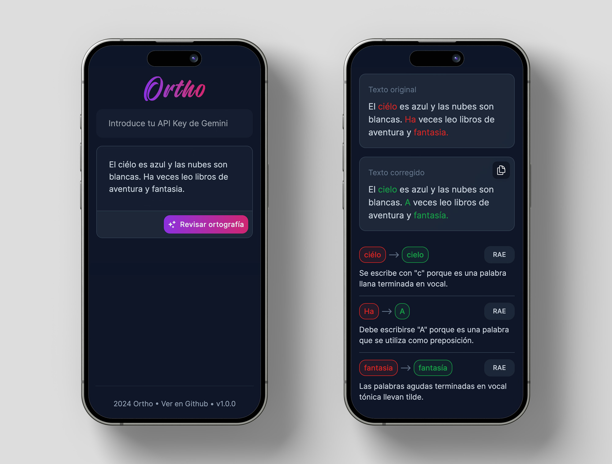

 

# Ortho App AI

**Corrige tu ortografía y aprende cuáles han sido los errores para no volver a caer en ellos.**

Ortho es una aplicación web fácil de usar, construida con Next.js y Tailwind, que permite revisar la ortografía y la gramática de textos. Ofrece sugerencias para cada corrección y enlace directo a la explicación en la RAE (Real Academia Española), lo que la convierte en una herramienta realmente útil.



## Instalación y uso en local

#### 1. Clona el repositorio:

```bash
git clone https://github.com/Bolita-Dev/ortho-app-ai.git
```

#### 2. Navega al directorio del proyecto:

```bash
cd ortho-app-ai
```

#### 3. Instala las dependencias:

```bash
npm install
# o si usas Yarn:
yarn install
```

#### 4. Ejecuta el servidor local:

```bash
npm run dev
# o si usas Yarn:
yarn dev
```

#### 5. Abre http://localhost:3000 para verlo en tu navegador.

## FAQ

#### ¿Ortho es gratis?

Sí, el uso de Ortho es completamente gratis, pero **deberás disponer de una API key de Google Gemini para poder usarla**. Esta API key es la que se utiliza para hacer las consultas a la IA.

#### ¿Ortho es infalible y siempre acierta en sus correcciones?

No, Ortho depende de los resultados que la IA Google Gemini devuelve, por tanto hay situaciones donde puede cometer errores.

#### ¿Es normal que tarde tanto en recibir un resultado?

El tiempo que tarda en conseguir una respuesta es proporcional al tamaño del texto a revisar. Si el texto tiene varios párrafos, el tiempo puede ser de entre 10-20 segundos.

#### ¿Puedo clonar el repositorio de Ortho para hacer mis propias versiones de la app?

Sí, puedes hacerlo, ya que su licencia es GNU GPLv3.

## Licencia

Este proyecto está licenciado bajo la Licencia GNU GPLv3 - consulta el archivo LICENSE para más detalles.

[GNU GPLv3](https://choosealicense.com/licenses/gpl-3.0/)
